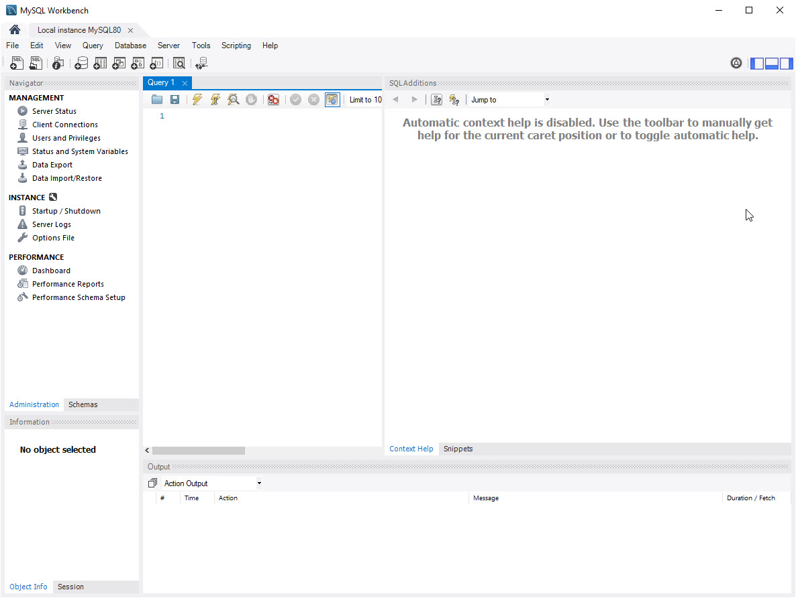
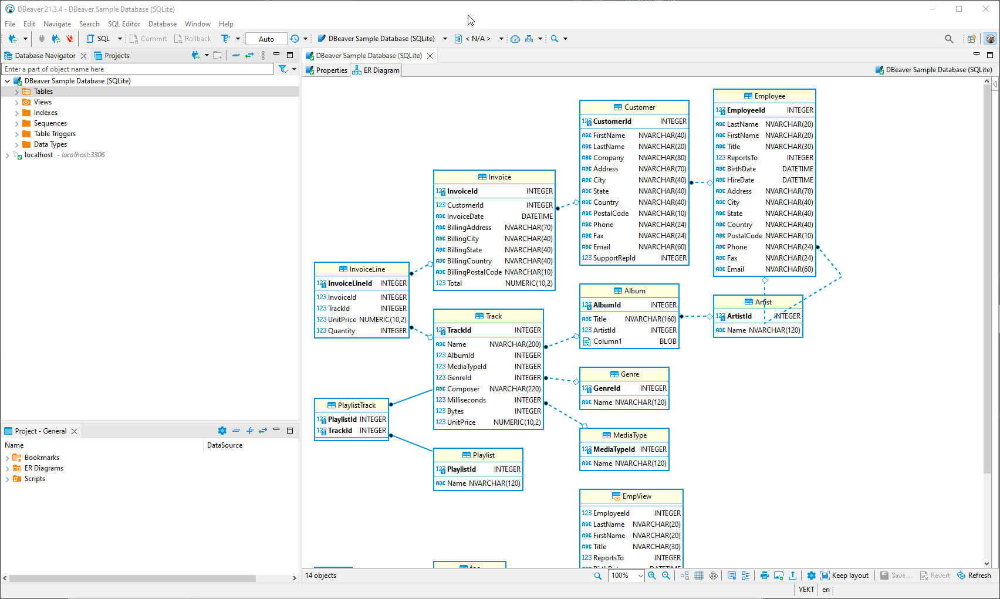
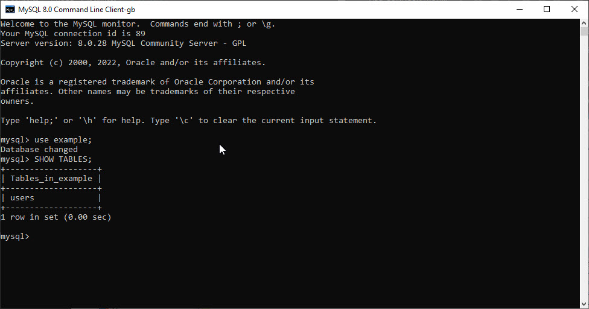
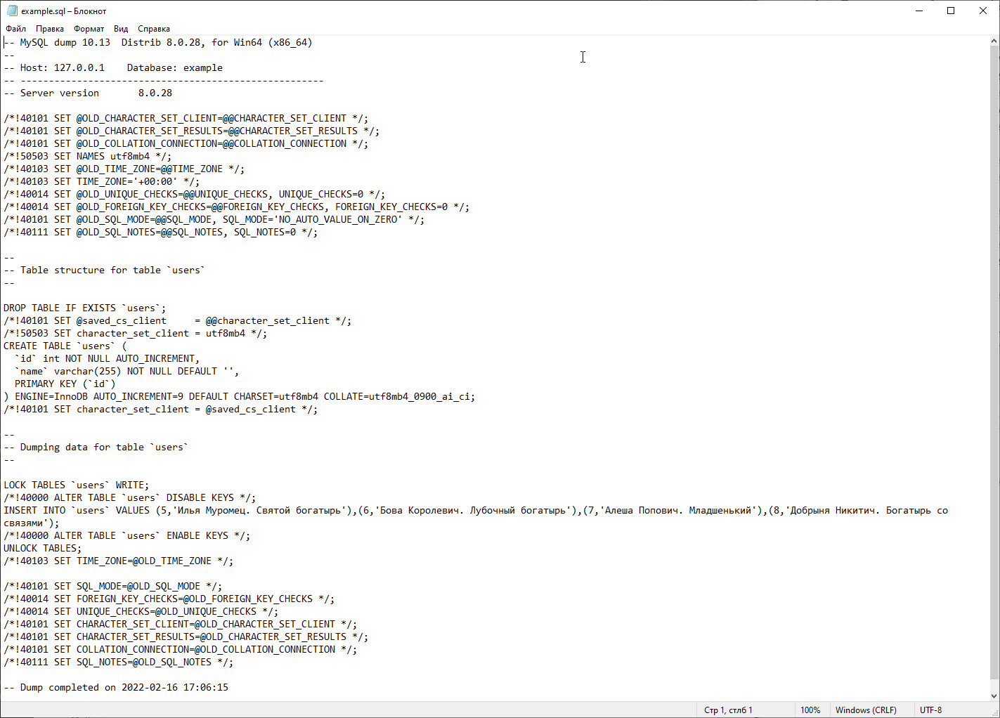

## Решение ДЗ №2 “Управление БД”:

1.1. Установил MySql на Win10:

1.2.  Установил Dbeaver:

1.3. Создал в директории `C:\Program Files\MySQL\MySQL Server 8.0` файл my.cnf с содержимым,

```editorconfig
[mysql]
user=root
password=password
host=127.0.0.1
port=3306
```

1.4. В файле `my.ini` в `c:\ProgramData\MySQL\MySQL Server 8.0\` исправил кодировку
`default-character-set=utf8mb4`

1.5. В свойствах ярлыка `MySQL 8.0 Command Line Client` изменил параметры запуска

`"C:\Program Files\MySQL\MySQL Server 8.0\bin\mysql.exe" "--defaults-file=C:\Program Files\MySQL\MySQL Server 8.0\my.cnf"`


Теперь консоль открывается без вопросов.



2. Сделаем базу данных example
```sql
DROP DATABASE
IF
	EXISTS example;
CREATE DATABASE
IF
	NOT EXISTS example CHARACTER
	SET utf8mb4 COLLATE utf8mb4_0900_ai_ci;
USE example;
CREATE TABLE `users` ( `id` INT NOT NULL AUTO_INCREMENT, `name` VARCHAR ( 255 ) NOT NULL DEFAULT '', PRIMARY KEY ( `id` ) ) AUTO_INCREMENT = 5 ENGINE = INNODB DEFAULT CHARSET = utf8mb4;
insert into users(name)
values ('Илья Муромец. Святой богатырь'),('Бова Королевич. Лубочный богатырь'),('Алеша Попович. Младшенький'),('Добрыня Никитич. Богатырь со связями');
```

3. Для дампа базы создадим батник 

```bat
set MYSQL_HOST=127.0.0.1
set MYSQL_USER=root
set MYSQL_PASSWORD=password

set DUMP_DATABASE_NAME=example

mysqldump --user=%MYSQL_USER% --password=%MYSQL_PASSWORD% -h %MYSQL_HOST% %DUMP_DATABASE_NAME% > %DUMP_DATABASE_NAME%.sql
```

[Вот и сам bat файл](dump.bat)
и результат его работы [example.sql](data/example.sql)



Развернем содержимое дампа в новую базу данных sample

```sql
DROP DATABASE
IF
	EXISTS sample;
CREATE DATABASE
IF
	NOT EXISTS sample CHARACTER
	SET utf8mb4 COLLATE utf8mb4_0900_ai_ci;
```

Усовершенствуем батник

```bat
set MYSQL_HOST=127.0.0.1
set MYSQL_USER=root
set MYSQL_PASSWORD=password

set DUMP_DATABASE_NAME=example
set NEW_DATABASE_NAME=sample

mysqldump --user=%MYSQL_USER% --password=%MYSQL_PASSWORD% -h %MYSQL_HOST% %DUMP_DATABASE_NAME% > %DUMP_DATABASE_NAME%.sql

mysql --user=%MYSQL_USER% --password=%MYSQL_PASSWORD% %NEW_DATABASE_NAME% < %DUMP_DATABASE_NAME%.sql
```

Теперь новая база заполняется из дамп-файла

4. Создадим дамп таблицы help_keyword базы mysql. 

Для этого добавим в `dump.bat` строку `mysqldump --user=%MYSQL_USER% --password=%MYSQL_PASSWORD% -h %MYSQL_HOST% --where="1 limit 100" %DATABASE_NAME% %TABLE% > data\%DATABASE_NAME%-%TABLE%.sql`

Результат работы доступен в папке `data`


